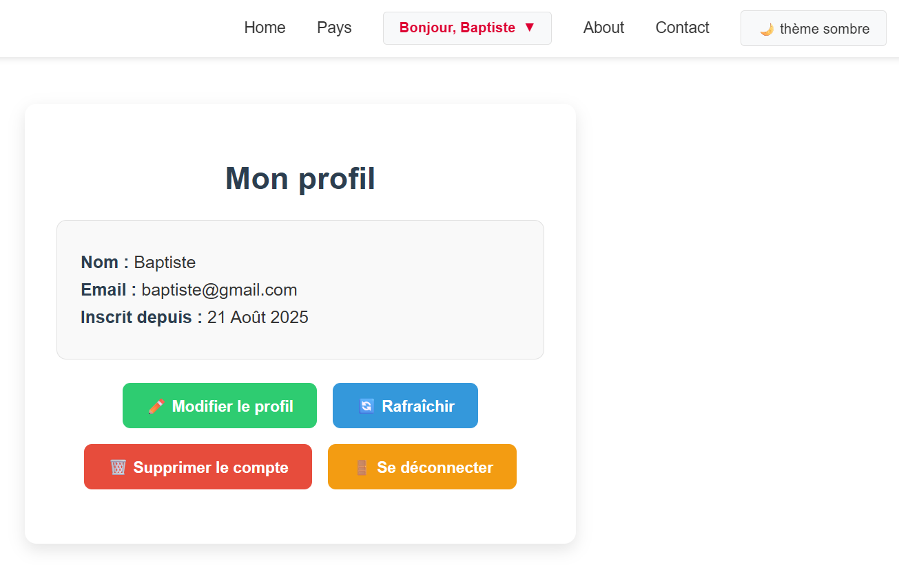
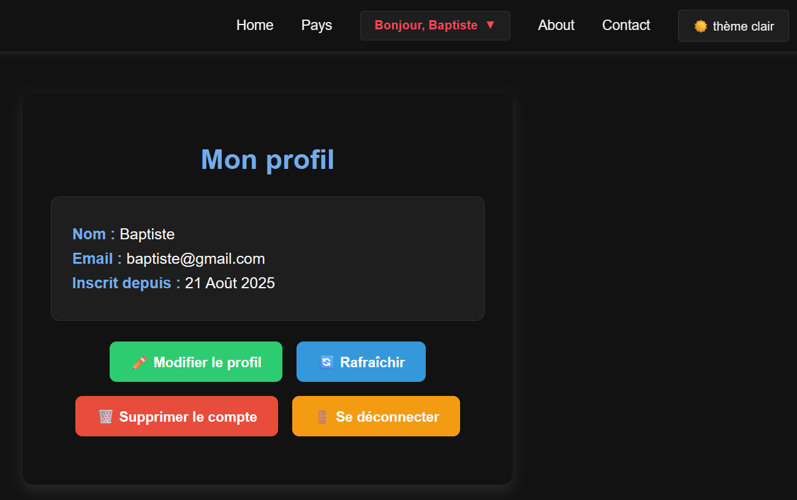
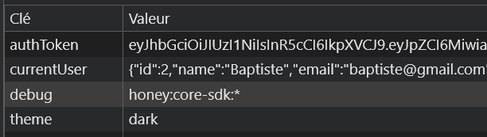
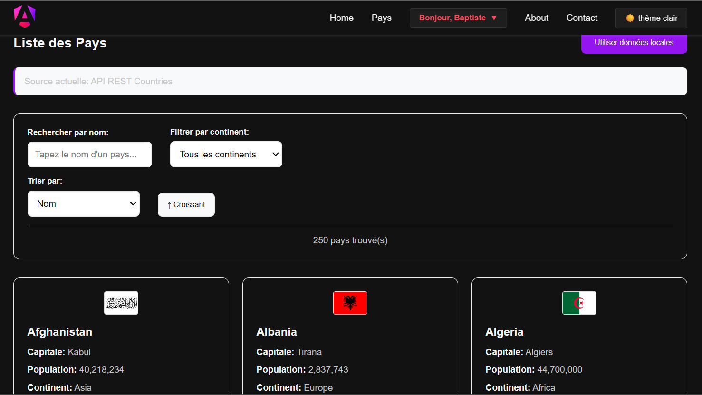

# Sujet de TP : Gestion du contexte utilisateur dans l’application Angular

## 1. Mise en place du contexte utilisateur

- Le service UserContextService a été créé ici : [src\app\services\userContext\user-context.service.ts](src/app/services/userContext/user-context.service.ts)

- Il contient les trois fonctions suivantes :

    * `setUser(user: User): void`
    * `getUser(): User | null`
    * `getUser$(): Observable<User | null>`
    * `clearUser(): void`
    * D'autres fonctions pottentiellement utiles mais pas utilisées ici.

## 2. Barre de navigation dynamique

La navbar affiche dynamiqument le nom de l'utilisater, mais pas l'avatar ni le rôle puisque nous n'en avons pas créé dans [backend\src\models\user.model.js](backend\src\models\user.model.js).

](src/assets/navbar.png)

## 3. Personnalisation du thème (100% front)

Un service [src\app\services\theme.service.ts](src\app\services\theme.service.ts) a été créé pour personnaliser le thème de l'application. Il contient les fonciton :

    * `setTheme(theme: 'light' | 'dark'): void`
    * `getCurrentTheme(): string`
    * `loadTheme(): void`
    * `toggleTheme(): void`

Les variables globales CSS ont été ajoutées dans le fichier [src\styles.scss](src\styles.scss) afin de centraliser les couleurs dans un seul fichier, qui sont utilisées par l'ensemble des fichiers .scss de l'application.

|  |  |
| :---: | :---: |
| Thème clair | Thème sombre |

## Bonus

Les informations de l'utilisateur ainsi que le thème sont sauvegardées en local storage. En cas de refresh, l'utilisateur reste connecté.

Et j'ai aussi utilisé l'api de [restcountries.com](restcountries.com) pour afficher les pays de monde.

J'y ai ajouté un **filtre** par *continent* ; une **recharge** par *nom* ; et un **trie** par ordre croissant et décroissant de *population*, de *nom* et de *continent*.

](src/assets/pays.png)
